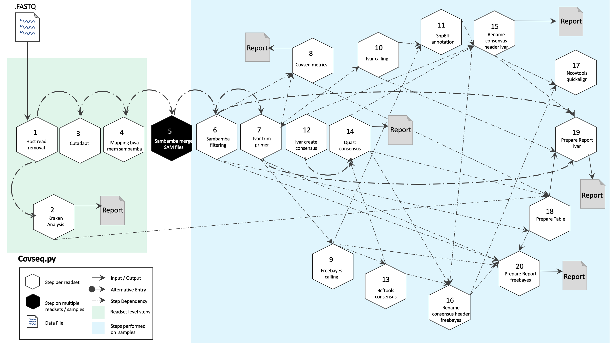

[TOC]


CoV Sequencing Pipeline
========================

CoV Sequencing Pipeline can be used to effectively amplify and detect SARS-CoV-2 RNA in samples such that it enables reliable results from even low copy numbers. It helps to assay clean characteristic target peaks of defined sizes, allowing for direct detection of the presence of viral genome from the Coronaviridae family.  Sequencing provides confirmation for the species as well as phylogenetic information for the specific strain discrimination.

The design of this pipeline is directed against SARS-CoV-2 and other coronaviruses as well. By amplifying conserved regions of other coronaviruses in a sample, along with mutation tolerant panels, it can provide additional insights and pinpoint sequence variability, thus offering a powerful solution for more in-depth research and surveillance of the rapidly evolving virus.

CoVSeQ pipeline is designed as part of the [partnership for Québec SARS-CoV-](https://c3g.github.io/covseq_McGill/SARS_CoV2_Sequencing/about.html) sequencing. It is funded by the CanCOGeN initiative through Genome Canada and from the Ministere de la santé et des services sociaux du Québec. For more details, se[CoVSeQ website](https://covseq.ca].

Usage
-----

```
#!text

usage: covseq.py [-h] [--help] [-c CONFIG [CONFIG ...]]
                                  [-s STEPS] [-o OUTPUT_DIR]
                                  [-j {pbs,batch,daemon,slurm}] [-f]
                                  [--no-json] [--report] [--clean]
                                  [-l {debug,info,warning,error,critical}]
                                  [--sanity-check]
                                  [--container {docker, singularity} {<CONTAINER PATH>, <CONTAINER NAME>}] [-v]

Version: 3.3.0

For more documentation, visit our website: https://bitbucket.org/mugqic/mugqic_pipelines/

optional arguments:
  -h                    show this help message and exit
  --help                show detailed description of pipeline and steps
  -c CONFIG [CONFIG ...], --config CONFIG [CONFIG ...]
                        config INI-style list of files; config parameters are
                        overwritten based on files order
  -s STEPS, --steps STEPS
                        step range e.g. '1-5', '3,6,7', '2,4-8'
  -o OUTPUT_DIR, --output-dir OUTPUT_DIR
                        output directory (default: current)
  -j {pbs,batch,daemon,slurm}, --job-scheduler {pbs,batch,daemon,slurm}
                        job scheduler type (default: slurm)
  -f, --force           force creation of jobs even if up to date (default:
                        false)
  --no-json             do not create JSON file per analysed sample to track
                        the analysis status (default: false i.e. JSON file
                        will be created)
  --report              create 'pandoc' command to merge all job markdown
                        report files in the given step range into HTML, if
                        they exist; if --report is set, --job-scheduler,
                        --force, --clean options and job up-to-date status are
                        ignored (default: false)
  --clean               create 'rm' commands for all job removable files in
                        the given step range, if they exist; if --clean is
                        set, --job-scheduler, --force options and job up-to-
                        date status are ignored (default: false)
  -l {debug,info,warning,error,critical}, --log {debug,info,warning,error,critical}
                        log level (default: info)
  --sanity-check        run the pipeline in `sanity check mode` to verify that
                        all the input files needed for the pipeline to run are
                        available on the system (default: false)
  --container {docker, singularity} {<CONTAINER PATH>, <CONTAINER NAME>}
                        run pipeline inside a container providing a container
                        image path or accessible docker/singularity hub path
  -r READSETS, --readsets READSETS
                        nanuq readset file. The default file is
                        'run.nanuq.csv' in the output folder. Will be
                        automatically downloaded if not present.
  -v, --version         show the version information and exit

Steps:
------
```

[download full-size diagram](https://bitbucket.org/mugqic/genpipes/src/master/resources/workflows/GenPipes_covseq.png)
```
1- host_reads_removal
2- kraken_analysis
3- cutadapt
4- mapping_bwa_mem_sambamba
5- sambamba_merge_sam_files
6- sambamba_filtering
7- ivar_trim_primers
8- covseq_metrics
9- ivar_calling
10- quast_consensus_metrics

```
host_reads_removal
-------------------
In this step, the filtered reads are aligned to a reference genome. The alignment is done per sequencing readset using the [BWA Software] and [BWA-Mem Algorithm]. BWA output BAM files are then sorted by coordinate using [Sambamba]

Input files for this step include:

* Trimmed FASTQ files, if available
* If no FASTQ files then FASTQ files from supplied readset is used.
* If no readset is supplied then FASTQ output from Picard SAM to FASTQ conversion of BAM files is used.

kraken_analysis
----------------
[Kraken] is an ultra fast and highly accurate mechanism for assigning taxonomic labels to metagenomic DNA sequences. It achieves high sensitivity and speed by utilizing exact alignments of k-mers and a novel classification algorithm. This step performs Kraken analysis using output of the Sambamba processing in :ref:`previous step<Host Reads Removal>`.

cutadapt
---------

[Cutadapt processing] cleans data by finding and removing adapter sequences, primers, poly-A tails and other types of unwanted sequence from high throughput sequencing reads obtained after Kraken analysis. In this step, quality trimming of raw reads and removing of adapters is performed by giving 'Adapter1' and 'Adapter2' columns from the readset file to Cutadapt. For PAIRED_END readsets, both adapters are used. For SINGLE_END readsets, only Adapter1 is used and left unchanged.

To trim the front of the read, use adapter_5p_fwd and adapter_5p_rev (For PAIRED_END only) in cutadapt section of the .ini file.

This step takes as input files:

1. FASTQ files from the readset file, if available.
2. Otherwise, FASTQ output files from previous Picard SAM to FASQ conversion of BAM files is used.

mapping_bwa_mem_sambamba
-------------------------

This step takes as input files trimmed FASTQ files, if available. Otherwise it takes FASTQ files from the readset. If readset is not supplied then it uses FASTQ output files from the previous Picard SAM to FASTQ conversion of BAM files.

Here, the filtered reads are aligned to a reference genome. The alignment is done per sequencing readset. [BWA Software] is used for alignment with [BWA-Mem Algorithm]. BWA output BAM files are then sorted by coordinate using [Sambamba].

sambamba_merge_sam_files
------------------------

This step uses [Sambamba-Merge Tool] to merge several BAM files into one. SAM headers are merged automatically similar to how it is done in Picard merging tool.

sambamba_filtering
-------------------

In this step, raw BAM files are filtered using [Sambamba] and and ```awk``` command is run to filter by insert size.

ivar_trim_primers
-----------------

[iVar] uses primer positions supplied in a BED file to soft clip primer sequences from an aligned and sorted BAM file. Following this, the reads are trimmed based on a quality threshold(Default: 20). To do the quality trimming, iVar uses a sliding window approach(Default: 4). The windows slides from the 5' end to the 3' end and if at any point the average base quality in the window falls below the threshold, the remaining read is soft clipped.

covseq_metrics
--------------

In this step, multiple metrics are computed from sequencing:

* DNA Sample [Qualimap] to facilitate quality control of alignment sequencing
* [Sambamba-flagstat] for obtaining flag statistics from BAM file
* [BED Tools GenomeCov] is used for computing histograms(default), per-base reports and BEDGRAPH summaries of feature coverage of aligned sequences for a given genome.
* [Picard HS Metrics] are picked from SAM/BAM files. Only those metrics are collected that are specific for sequence datasets generated through hybrid-selection. Hybrid-selection (HS) is the most commonly used technique to capture exon-specific sequences for targeted sequencing experiments such as exome sequencing.

ivar_calling
------------

In this step, [iVar] is used for creating a trimmed BAM file after trimming aligned reads in the input BAM file using primer positions specified in the BED input file.

quast_consensus_metrics
-----------------------

In this step, [QUAST] is used to compare and evaluate assemblies to rule out misassemblies.

rename_consensus_header
------------------------

[Consensus sequence] is the calculated order of most frequent residues found at each position in a sequence alignment. This information is important when considering sequence-dependent enzymes such as RNA Polymerase which is important for SAR-CoV-2 studies. In this step, [header sequence] can be modified in various ways as specified in rename type parameter: Multipart header, Replace word, Replace interval, and Add prefix/suffix.

This is the final step of CovSeq pipeline.

[Kraken]: https://www.ncbi.nlm.nih.gov/pmc/articles/PMC4053813/
[Cutadapt processing]: https://cutadapt.readthedocs.io/en/stable/index.html
[Sambamba]: http://lomereiter.github.io/sambamba/index.html
[BWA Software]: (http://bio-bwa.sourceforge.net)
[BWA-Mem Algorithm]: (http://bio-bwa.sourceforge.net/bwa.shtml)
[Sambamba-Merge Tool]: https://lomereiter.github.io/sambamba/docs/sambamba-merge.html
[iVar]: https://andersen-lab.github.io/ivar/html/manualpage.html
[Sambamba-flagstat]: https://lomereiter.github.io/sambamba/docs/sambamba-flagstat.html
[Qualimap]: http://qualimap.conesalab.org
[BED Tools GenomeCov]: https://bedtools.readthedocs.io/en/latest/content/tools/genomecov.html
[Picard HS Metrics]:  https://github.com/broadinstitute/picard/blob/master/src/main/java/picard/analysis/directed/CollectHsMetrics.java
[QUAST]: https://academic.oup.com/bioinformatics/article/29/8/1072/228832
[Consensus sequence]: https://en.wikipedia.org/wiki/Consensus_sequence
[header sequence]: http://www.sing-group.org/seda/downloads/manuals/0.4.0/operations.html#rename-header
